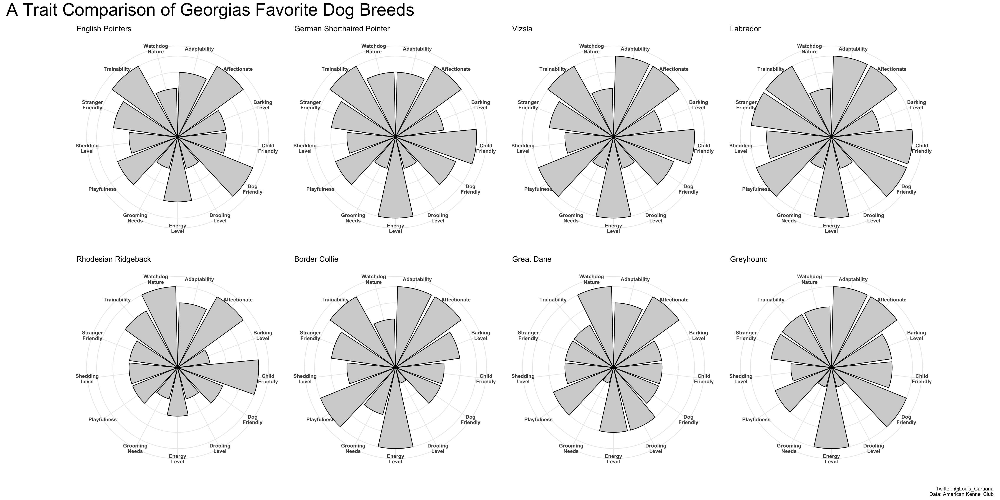

Dog Breeds
================

``` r
breed_traits <- readr::read_csv('https://raw.githubusercontent.com/rfordatascience/tidytuesday/master/data/2022/2022-02-01/breed_traits.csv')
```

    ## Rows: 195 Columns: 17
    ## ── Column specification ────────────────────────────────────────────────────────
    ## Delimiter: ","
    ## chr  (3): Breed, Coat Type, Coat Length
    ## dbl (14): Affectionate With Family, Good With Young Children, Good With Othe...
    ## 
    ## ℹ Use `spec()` to retrieve the full column specification for this data.
    ## ℹ Specify the column types or set `show_col_types = FALSE` to quiet this message.

``` r
trait_description <- readr::read_csv('https://raw.githubusercontent.com/rfordatascience/tidytuesday/master/data/2022/2022-02-01/trait_description.csv')
```

    ## Rows: 16 Columns: 4
    ## ── Column specification ────────────────────────────────────────────────────────
    ## Delimiter: ","
    ## chr (4): Trait, Trait_1, Trait_5, Description
    ## 
    ## ℹ Use `spec()` to retrieve the full column specification for this data.
    ## ℹ Specify the column types or set `show_col_types = FALSE` to quiet this message.

``` r
breed_rank_all <- readr::read_csv('https://raw.githubusercontent.com/rfordatascience/tidytuesday/master/data/2022/2022-02-01/breed_rank.csv')
```

    ## Rows: 195 Columns: 11
    ## ── Column specification ────────────────────────────────────────────────────────
    ## Delimiter: ","
    ## chr (3): Breed, links, Image
    ## dbl (8): 2013 Rank, 2014 Rank, 2015 Rank, 2016 Rank, 2017 Rank, 2018 Rank, 2...
    ## 
    ## ℹ Use `spec()` to retrieve the full column specification for this data.
    ## ℹ Specify the column types or set `show_col_types = FALSE` to quiet this message.

``` r
breed_traits %>%
  mutate(number = row_number()) %>%
  select(-'Breed') -> TraitsTidy

breed_rank_all %>%
  mutate(number = row_number()) %>%
  select('Breed', 'number')-> RankTidy 

DogDataTidy <- RankTidy %>% full_join(TraitsTidy)
```

    ## Joining with `by = join_by(number)`

``` r
DogDataTidy %>% filter(Breed %in% c('Retrievers (Labrador)',
                      'Pointers (German Shorthaired)', 
                      'Great Danes',
                      'Border Collies',
                      'Vizslas',
                      'Rhodesian Ridgebacks',
                      'Pointers',
                      'Greyhounds')) %>%
  select(-'number',
         -'Coat Type',
         -'Coat Length',
         -'Mental Stimulation Needs') %>%
  rename('Affectionate' = 'Affectionate With Family') %>%
  rename('Child Friendly' = 'Good With Young Children') %>%
  rename('Dog Friendly' = 'Good With Other Dogs') %>%
  rename('Stranger Friendly' = 'Openness To Strangers') %>%
  rename('Playfulness' = 'Playfulness Level') %>%
  rename('Grooming Needs' = 'Coat Grooming Frequency') %>%
  rename('Watchdog Nature' = 'Watchdog/Protective Nature') %>%
  rename('Adaptability' = 'Adaptability Level') %>%
  rename('Trainability' = 'Trainability Level') -> DogDataTidy


DogDataTidy
```

    ## # A tibble: 8 × 14
    ##   Breed            Affectionate `Child Friendly` `Dog Friendly` `Shedding Level`
    ##   <chr>                   <dbl>            <dbl>          <dbl>            <dbl>
    ## 1 Retrievers (Lab…            5                5              5                4
    ## 2 Pointers (Germa…            5                5              4                3
    ## 3 Great Danes                 5                3              3                3
    ## 4 Border Collies              5                3              3                3
    ## 5 Vizslas                     5                5              4                3
    ## 6 Rhodesian Ridge…            5                5              3                3
    ## 7 Pointers                    5                3              5                3
    ## 8 Greyhounds                  4                3              4                2
    ## # ℹ 9 more variables: `Grooming Needs` <dbl>, `Drooling Level` <dbl>,
    ## #   `Stranger Friendly` <dbl>, Playfulness <dbl>, `Watchdog Nature` <dbl>,
    ## #   Adaptability <dbl>, Trainability <dbl>, `Energy Level` <dbl>,
    ## #   `Barking Level` <dbl>

``` r
DogDataTidy %>%
  pivot_longer(!Breed, names_to = 'Trait', values_to = 'count') -> DogDataLong

DogDataLong
```

    ## # A tibble: 104 × 3
    ##    Breed                 Trait             count
    ##    <chr>                 <chr>             <dbl>
    ##  1 Retrievers (Labrador) Affectionate          5
    ##  2 Retrievers (Labrador) Child Friendly        5
    ##  3 Retrievers (Labrador) Dog Friendly          5
    ##  4 Retrievers (Labrador) Shedding Level        4
    ##  5 Retrievers (Labrador) Grooming Needs        2
    ##  6 Retrievers (Labrador) Drooling Level        2
    ##  7 Retrievers (Labrador) Stranger Friendly     5
    ##  8 Retrievers (Labrador) Playfulness           5
    ##  9 Retrievers (Labrador) Watchdog Nature       3
    ## 10 Retrievers (Labrador) Adaptability          5
    ## # ℹ 94 more rows

``` r
DogPlot = function(x, y=''){x %>%
  ggplot(aes(Trait, count)) +
  geom_col(fill = "lightgray",
           color = "black") +
  coord_polar() +
  labs(title = y,) +
  theme_minimal() +
  theme(axis.text.y=element_blank(),
        axis.ticks.y=element_blank(),
        axis.text = element_text(face="bold")) +
  ylab("") +
  xlab("") +
  scale_x_discrete(labels = function(x) str_wrap(x, width = 10))
}
```

``` r
DogDataLong %>%
  filter(Breed == 'Retrievers (Labrador)') %>%
DogPlot(y='Labrador') -> p1

DogDataLong %>%
  filter(Breed == 'Pointers (German Shorthaired)') %>%
DogPlot(y='German Shorthaired Pointer') -> p2

DogDataLong %>%
  filter(Breed == 'Great Danes') %>%
DogPlot(y='Great Dane') -> p3

DogDataLong %>%
  filter(Breed == 'Border Collies') %>%
DogPlot(y='Border Collie') -> p4

DogDataLong %>%
  filter(Breed == 'Vizslas') %>%
DogPlot(y='Vizsla') -> p5

DogDataLong %>%
  filter(Breed == 'Rhodesian Ridgebacks') %>%
DogPlot(y='Rhodesian Ridgeback') -> p6

DogDataLong %>%
  filter(Breed == 'Pointers') %>%
DogPlot(y='English Pointers') -> p7

DogDataLong %>%
  filter(Breed == 'Greyhounds') %>%
DogPlot(y='Greyhound') -> p8
```

``` r
(p7 | p2 | p5 | p1) /
(p6 | p4 | p3 | p8) + plot_annotation(
  title = 'A Trait Comparison of Georgias Favorite Dog Breeds',
  caption = 'Twitter: @Louis_Caruana\nData: American Kennel Club',
  theme = theme(plot.title = element_text(size = 30)))
```


