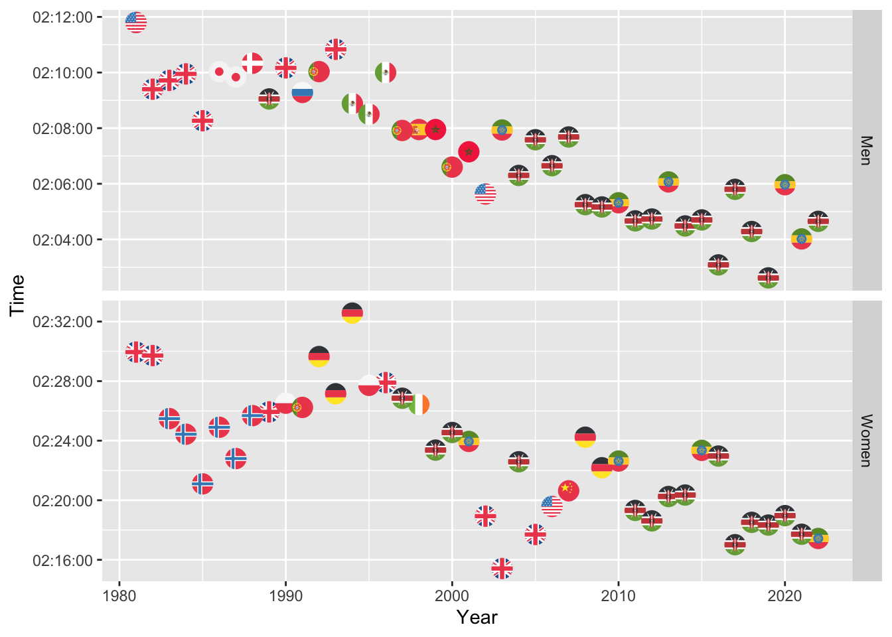
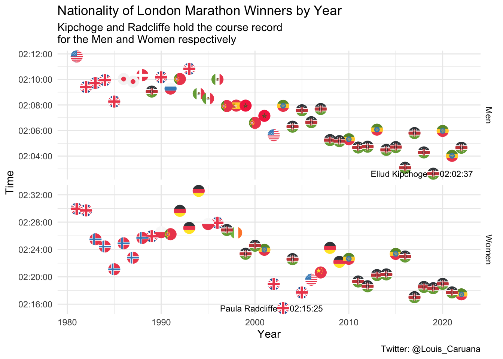

London Marathon
================

I started by loading in and exploring the `winners` data set. I decided
that I wanted to highlight the nationalities in the chart, while also
highlighting the fastest times in both categories.

``` r
winners <- readr::read_csv('https://raw.githubusercontent.com/rfordatascience/tidytuesday/master/data/2023/2023-04-25/winners.csv')
```

    ## Rows: 163 Columns: 5
    ## ── Column specification ────────────────────────────────────────────────────────
    ## Delimiter: ","
    ## chr  (3): Category, Athlete, Nationality
    ## dbl  (1): Year
    ## time (1): Time
    ## 
    ## ℹ Use `spec()` to retrieve the full column specification for this data.
    ## ℹ Specify the column types or set `show_col_types = FALSE` to quiet this message.

`!grepl` called within the filter function will filter out any rows that
contain a specific string within the category column in this example. I
also changed all countries to their ISO 3166-2 code, note lower case
works best for use with `ggflags`

``` r
WinnersTidy <- winners %>%
  filter(!grepl('Wheelchair', Category)) %>%
   mutate(Nationality = replace(Nationality, Nationality == 'United States' , 'us')) %>%
   mutate(Nationality = replace(Nationality, Nationality == 'Norway' , 'no')) %>%
   mutate(Nationality = replace(Nationality, Nationality == 'United Kingdom' , 'gb')) %>%
   mutate(Nationality = replace(Nationality, Nationality == 'Japan' , 'jp')) %>%
   mutate(Nationality = replace(Nationality, Nationality == 'Denmark' , 'dk')) %>%
   mutate(Nationality = replace(Nationality, Nationality == 'Kenya' , 'ke')) %>%
   mutate(Nationality = replace(Nationality, Nationality == 'Soviet Union' , 'ru')) %>%
   mutate(Nationality = replace(Nationality, Nationality == 'Portugal' , 'pt')) %>%
   mutate(Nationality = replace(Nationality, Nationality == 'Mexico' , 'mx')) %>%
   mutate(Nationality = replace(Nationality, Nationality == 'Spain' , 'es')) %>%
   mutate(Nationality = replace(Nationality, Nationality == 'Morocco' , 'ma')) %>%
   mutate(Nationality = replace(Nationality, Nationality == 'Ethiopia' , 'et')) %>%
   mutate(Nationality = replace(Nationality, Nationality == 'Poland' , 'pl')) %>%
   mutate(Nationality = replace(Nationality, Nationality == 'Germany' , 'de')) %>%
   mutate(Nationality = replace(Nationality, Nationality == 'Ireland' , 'ie')) %>%
   mutate(Nationality = replace(Nationality, Nationality == 'China' , 'cn'))
```

I decided to split both categories into a facet grid, as men and women
compete separately I did not want them on the same axis. I set the
scales to free which allows both y axis to adjust to fit each set of
data better. After a lot of trial and error I managed to get
`geom_flag()` working, geom flag hits an error when looking for a Soviet
Union flag, there is a work around available for this, but in this case
I just used the Russia flag instead.

``` r
  ggplot(WinnersTidy, aes(x = Year, y = Time)) +
  facet_grid(rows = vars(Category), scales = "free") +
  geom_flag(aes(country = Nationality), size = 5) 
```



I have now decided that I want to label the course records with their
name and time, so I now need to extract these from the data set and
create a new data set RecordsTidy.

``` r
RecordsTidy <- WinnersTidy %>% 
   group_by(Category) %>% 
   slice_min(order_by = Time)

RecordsTidy
```

    ## # A tibble: 2 × 5
    ## # Groups:   Category [2]
    ##   Category  Year Athlete         Nationality Time    
    ##   <chr>    <dbl> <chr>           <chr>       <time>  
    ## 1 Men       2019 Eliud Kipchoge  ke          02:02:37
    ## 2 Women     2003 Paula Radcliffe gb          02:15:25

In order to combine both data sets into the chart I needed to reorder
some of the ggplot call to load the relevant data set into each
respective geom. This allows me to have only the RecordsTidy subset data
labelled rather than each flag. Also I could not manually add the text
to the chart, im not sure if it is because of the facet or becuase of
the time data being difficult to work with.

``` r
  ggplot() +
  geom_flag(data = WinnersTidy,aes(x = Year, y = Time, country = Nationality), size = 5) +
  geom_text(data = RecordsTidy, aes(x = Year, y = Time, label = Athlete),
            hjust = +1.1, size = 3) +
  geom_text(data = RecordsTidy, aes(x = Year, y = Time, label = Time),
            hjust = -0.2, size = 3) +
  facet_grid(rows = vars(Category), scales = "free")+
  theme_minimal() +
  labs(title = "Nationality of London Marathon Winners by Year ",
       subtitle = "Kipchoge and Radcliffe hold the course record \nfor the Men and Women respectively",
       caption = "Twitter: @Louis_Caruana")
```


